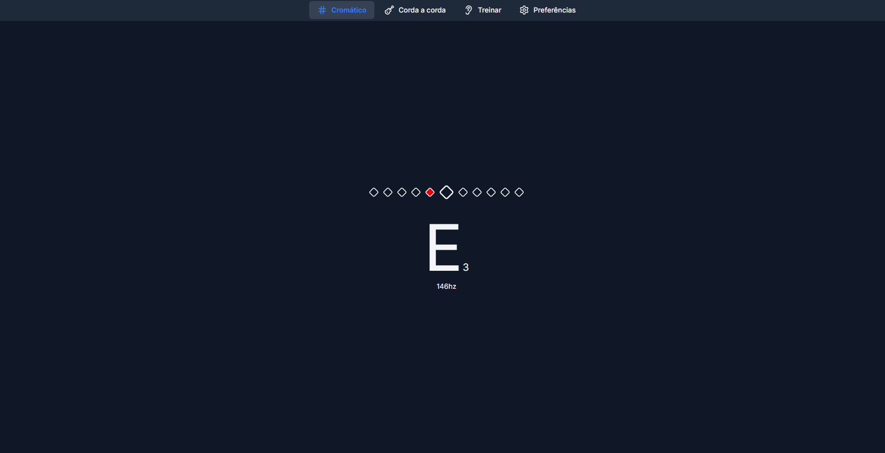
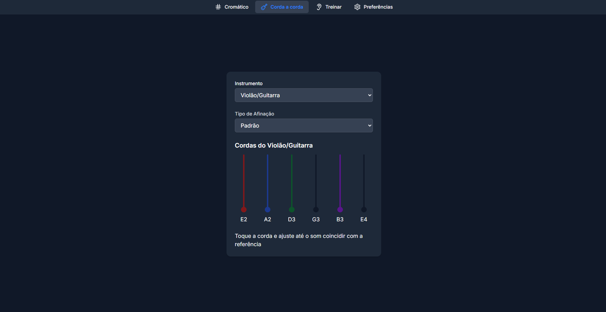
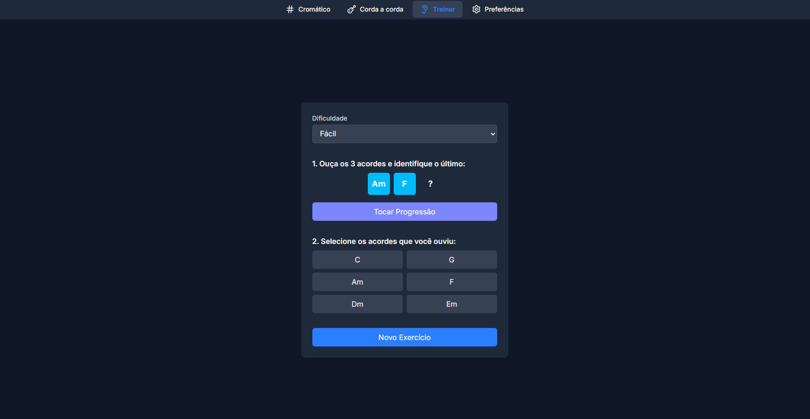

# next-tuner

## Português

**next-tuner** é um afinador de instrumentos, principalmente instrumentos de cordas — mas não exclusivamente.
Este app foi desenvolvido para estudo, desenvolvimento e aplicação de tecnologias. O código da pasta `hooks` foi gerado com a ajuda de inteligência artificial, com minha supervisão e guiado pelo meu conhecimento de teoria e técnica musical.

Além do afinador, o app oferece recursos extras para estudo e prática musical:

- **Referência de afinação** para diversos instrumentos de cordas (e diferentes tipos de afinação), ideal para treinar a afinação de ouvido;
- **Treino de afinação**, onde o usuário ouve uma nota de referência e tenta reproduzi-la apenas pelo ouvido — simulando o processo real de afinar instrumentos;
- **Treino de percepção harmônica**, no qual o usuário ouve uma sequência de acordes e precisa identificar a sequência correta — semelhante ao processo de tirar músicas de ouvido;
- **Configurações personalizáveis**, permitindo ajustar o padrão de afinação (ex: A=440Hz, A=432Hz, etc.), fazendo com que todo o app siga essa referência.

Este projeto foi desenvolvido para **estudar, praticar e aplicar tecnologias modernas de desenvolvimento web**.

---

## Features

- 🎵 Afinador para diversos instrumentos  
- 👂 Treino de afinação de ouvido  
- 🎹 Treino de percepção harmônica  
- ⚙️ Ajuste de padrão de afinação  
- 🌐 Interface web responsiva e moderna  

---

## Tech Stack

- **Next.js** – Estrutura principal do projeto  
- **React** – Criação de interfaces interativas  
- **TypeScript** – Tipagem estática e segurança no desenvolvimento  
- **Tailwind CSS** – Estilização rápida e responsiva  
- **Vercel** – Hospedagem e deploy contínuo  

---

## Capturas de Tela

### Tela inicial


### Afinador em funcionamento


### Treino de afinação de ouvido


### Treino de percepção harmônica


---

## Comandos básicos

Instale as dependências:

```bash
pnpm install

pnpm dev

pnpm build
```

## English

**next-tuner** is an instrument tuner, primarily string instruments — but not exclusively.
This app was developed for the study, development, and application of technologies. The code in the hooks folder was generated with the help of artificial intelligence, under my supervision and guided by my knowledge of music theory and technique.

In addition to the tuner, the app offers extra features for musical practice and ear training:

- **Tuning reference** for various string instruments (and different tuning styles), ideal for practicing tuning by ear;
- **Tuning training**, where the user listens to a reference note and tries to match it by ear — simulating the real-life process of tuning an instrument;
- **Harmony recognition training**, where the user listens to a sequence of chords and must identify the correct sequence — similar to figuring out songs by ear;
- **Customizable settings**, allowing you to change the tuning standard (e.g., A=440Hz, A=432Hz, etc.), so the entire app adapts to that reference.

This project was developed to **study, practice, and apply modern web development technologies**.

---

## Features

- 🎵 Tuner for multiple instruments  
- 👂 Ear training for tuning practice  
- 🎹 Harmony recognition training  
- ⚙️ Adjustable tuning reference  
- 🌐 Modern, responsive web interface  

---

## Tech Stack

- **Next.js** – Main framework of the project  
- **React** – Building interactive interfaces  
- **TypeScript** – Static typing for safer development  
- **Tailwind CSS** – Fast and responsive styling  
- **Vercel** – Hosting and continuous deployment  

---

## Screenshots

> **Note:** The images below are just examples.  
> Place the actual files inside the `public/screenshots` folder and update the paths accordingly.

### Home Screen


### Tuner in Action


### Ear Training


### Harmony Recognition Training


---

## Basic Commands

Install dependencies:

```bash
pnpm install

pnpm dev

pnpm build
```